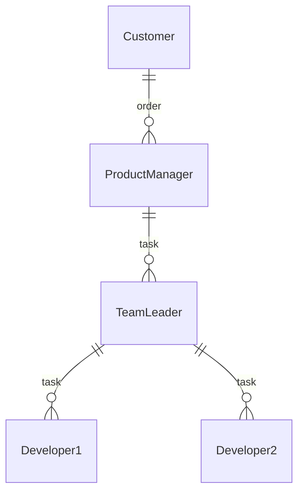

# **YaMDb**
Проект YaMDb собирает отзывы (Review) пользователей на произведения (Titles). Произведения делятся на категории: «Книги», «Фильмы», «Музыка». Список категорий (Category) может быть расширен администратором.
Сами произведения в YaMDb не хранятся, здесь нельзя посмотреть фильм или послушать музыку.
В каждой категории есть произведения: книги, фильмы или музыка.
Произведению может быть присвоен жанр (Genre) из списка предустановленных. Новые жанры может создавать только администратор.
Благодарные или возмущённые пользователи оставляют к произведениям текстовые отзывы (Review) и ставят произведению оценку в диапазоне от одного до десяти (целое число); из пользовательских оценок формируется усреднённая оценка произведения — рейтинг (целое число). На одно произведение пользователь может оставить только один отзыв.

## **Установка**:

Клонировать репозиторий и перейти в него в командной строке: 

_**$ git clone git@github.com:Mr-Elvis-Vis/api_yamdb.git**_ 

_**$ cd api_yamdb**_

Cоздать и активировать виртуальное окружение(_для Шindows_):

_**python -m venv env**_

_**source venv/scripts/activate**_

Установить зависимости из файла requirements.txt:

_**python -m pip install --upgrade pip**_

_**pip install -r requirements.txt**_

Выполнить миграции:

_**python manage.py migrate**_

Запустить проект:

_**python manage.py runserver**_ 

Проект доступен по адресу http://127.0.0.1:8000/

К проекту по адресу http://127.0.0.1:8000/redoc/ подключена документация **API YaMDb**.

## **Пользовательские роли**

**Аноним** — может просматривать описания произведений, читать отзывы и комментарии.

**Аутентифицированный пользователь (user)** — может читать всё, как и Аноним, может публиковать отзывы и ставить оценки произведениям (фильмам/книгам/песенкам), может комментировать отзывы; может редактировать и удалять свои отзывы и комментарии, редактировать свои оценки произведений. Эта роль присваивается по умолчанию каждому новому пользователю.

**Модератор (moderator)** — те же права, что и у Аутентифицированного пользователя, плюс право удалять и редактировать любые отзывы и комментарии.

**Администратор (admin)** — полные права на управление всем контентом проекта. Может создавать и удалять произведения, категории и жанры. Может назначать роли пользователям.

## **Самостоятельная регистрация новых пользователей**

Пользователь отправляет POST-запрос с параметрами email и username на эндпоинт _**/api/v1/auth/signup/**_.
Сервис YaMDB отправляет письмо с кодом подтверждения (confirmation_code) на указанный адрес email.
Пользователь отправляет POST-запрос с параметрами username и confirmation_code на эндпоинт _**/api/v1/auth/token/**_, в ответе на запрос ему приходит token (JWT-токен).
В результате пользователь получает токен и может работать с API проекта, отправляя этот токен с каждым запросом.
После регистрации и получения токена пользователь может отправить PATCH-запрос на эндпоинт _**/api/v1/users/me/**_ и заполнить поля в своём профайле (описание полей — в документации).

## Ресурсы API YaMDb
Ресурс auth: аутентификация.
Ресурс users: пользователи.
Ресурс titles: произведения, к которым пишут отзывы (определённый фильм, книга или песенка).
Ресурс categories: категории (типы) произведений («Фильмы», «Книги», «Музыка»).
Ресурс genres: жанры произведений. Одно произведение может быть привязано к нескольким жанрам.
Ресурс reviews: отзывы на произведения. Отзыв привязан к определённому произведению.
Ресурс comments: комментарии к отзывам. Комментарий привязан к определённому отзыву.

## Команда и структура разработки

:crown: [Артем Коломацкий__ProductManager](https://github.com/Roxe322)

:godmode: [Артем Висков_________TeamLeader](https://github.com/Mr-Elvis-Vis)

:godmode: [Игорь Кулаков________Developer_1](https://github.com/Igry44ik)

:godmode: [Иван Тапехин_________Developer_2](https://github.com/itapekhin)

